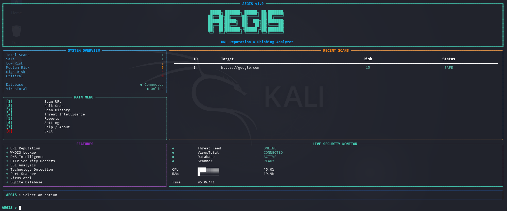
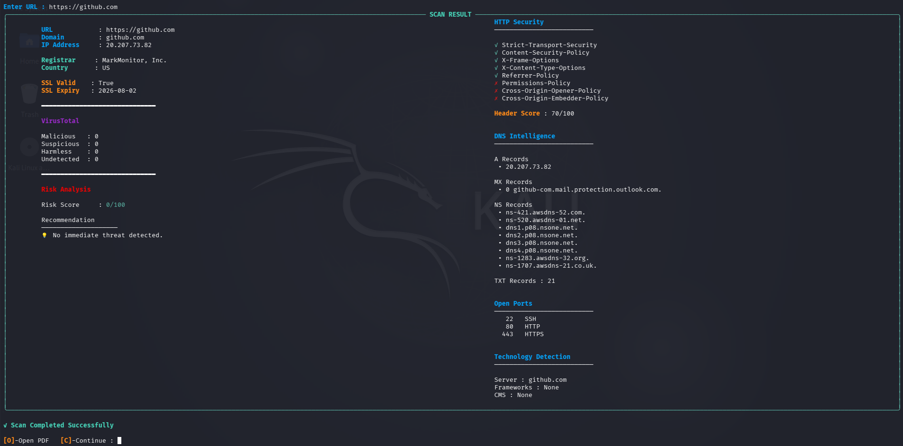
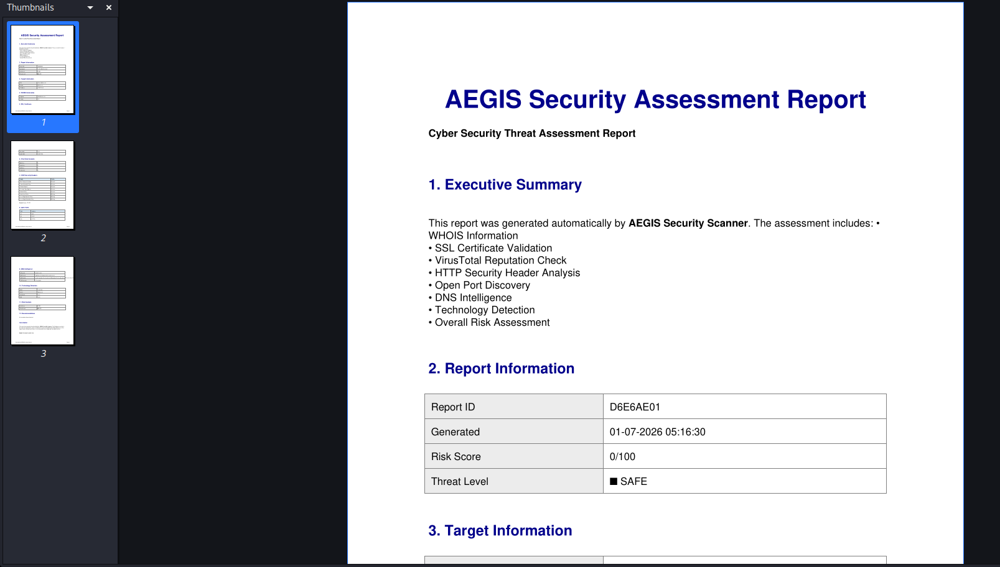

# AEGIS

> **Intelligent URL Threat Detection & Security Analysis Framework**

A modular, open-source cybersecurity framework for automated website reconnaissance, threat intelligence, and security assessment.

<p align="center">


</p>

---

## Overview

AEGIS is a Python-based cybersecurity framework designed to automate website security assessment by combining multiple reconnaissance and threat intelligence techniques into a single workflow.

Instead of manually switching between multiple tools, AEGIS performs automated analysis of a target URL, gathers security intelligence, evaluates risk indicators, and generates professional reports for further investigation.

Whether you're an ethical hacker, penetration tester, security researcher, SOC analyst, or cybersecurity student, AEGIS provides a streamlined approach to web security assessment.

---

## Why AEGIS?

Traditional website investigation often requires multiple independent tools.

AEGIS consolidates these capabilities into a single framework by integrating:

- Domain Intelligence
- DNS Enumeration
- SSL Inspection
- HTTP Security Header Analysis
- Technology Fingerprinting
- Port Scanning
- Threat Intelligence
- VirusTotal Reputation Analysis
- Automated Report Generation

The result is a faster, cleaner, and more consistent security assessment workflow.
## Features

AEGIS combines reconnaissance, threat intelligence, and security assessment into a single command-line framework.

| Category | Capabilities |
|----------|--------------|
| 🌐 Reconnaissance | URL Validation, WHOIS Lookup, DNS Intelligence |
| 🔒 Security Analysis | SSL Inspection, HTTP Security Headers, Technology Detection |
| 🎯 Threat Intelligence | VirusTotal Integration, Threat Correlation, Risk Scoring |
| 📡 Network Analysis | TCP Port Scanning |
| 📊 Reporting | Professional PDF Reports, CSV Export |
| 📂 Bulk Operations | Bulk URL Scanning |
| 💾 Data Management | SQLite Scan History |
| 🖥 Interface | Interactive Rich Dashboard |

---

### Core Capabilities

- Automated URL Threat Analysis
- WHOIS & DNS Enumeration
- SSL Certificate Inspection
- HTTP Security Header Analysis
- Technology Fingerprinting
- TCP Port Scanning
- VirusTotal Reputation Analysis
- Threat Intelligence Correlation
- Custom Risk Scoring Engine
- Bulk URL Processing
- Professional PDF Report Generation
- CSV Export Support
- Historical Scan Database
- Interactive Terminal Dashboard

---

## Technology Stack

| Component | Technology |
|-----------|------------|
| Language | Python 3 |
| Terminal UI | Rich |
| Database | SQLite |
| Reports | ReportLab |
| HTTP Requests | Requests |
| System Monitoring | psutil |
| Threat Intelligence | VirusTotal API |
| Configuration | python-dotenv |
---

## Screenshots

### Interactive Dashboard

The Rich-powered dashboard provides a real-time overview of system status, scan statistics, recent activity, and security monitoring.

> *(Dashboard screenshot will be added after the first public release.)*

<p align="center">

</p>

---

### URL Scan Report

Detailed scan results include:

- Domain Information
- DNS Intelligence
- SSL Certificate Analysis
- HTTP Security Headers
- Technology Fingerprinting
- VirusTotal Reputation
- Risk Score
- Security Recommendations

<p align="center">

</p>

---

### PDF Report

AEGIS automatically generates professional PDF reports suitable for documentation and further analysis.

<p align="center">

</p>

> **Note**
>
> Screenshots will be updated with every major release.
---

# Installation

## Prerequisites

Before installing AEGIS, ensure you have:

- Linux (Tested on Kali Linux)
- Python 3.11 or later
- Git

Verify your Python version:

```bash
python3 --version
```

---

## Clone the Repository

```bash
git clone https://github.com/sujalparmar27/AEGIS.git
cd AEGIS
```

---

## Option 1 — Virtual Environment (Recommended)

Create a virtual environment:

```bash
python3 -m venv venv
```

Activate it:

```bash
source venv/bin/activate
```

Install dependencies:

```bash
pip install -r requirements.txt
```

---

## Option 2 — System Installation

If you prefer not to use a virtual environment:

```bash
pip3 install -r requirements.txt
```

> **Note:** Using a virtual environment is recommended to avoid dependency conflicts with other Python projects.

---

## Configure the Environment

Create a `.env` file in the project root.

Example:

```env
VIRUSTOTAL_API_KEY=YOUR_API_KEY
```

Replace `YOUR_API_KEY` with your personal VirusTotal API key.

---

# Quick Start

Launch AEGIS:

```bash
python3 aegis.py
```

The interactive dashboard will appear, allowing you to:

- Perform URL security analysis
- Scan multiple URLs
- Generate PDF reports
- Export CSV reports
- View historical scan data
- Access threat intelligence modules

---

## Updating AEGIS

```bash
git pull origin main
```
---

# Architecture

AEGIS follows a modular architecture where each component is responsible for a single security domain.

```text
                    ┌────────────────────┐
                    │     User Input     │
                    └─────────┬──────────┘
                              │
                              ▼
                    ┌────────────────────┐
                    │   Dashboard (CLI)  │
                    └─────────┬──────────┘
                              │
             ┌────────────────┼────────────────┐
             ▼                ▼                ▼
      URL Scanner      Bulk Scanner     Threat Intelligence
             │                │                │
             └────────────────┼────────────────┘
                              ▼
                     Security Analysis Engine
                              │
        ┌──────────┬──────────┼──────────┬──────────┐
        ▼          ▼          ▼          ▼          ▼
      WHOIS       DNS        SSL      Headers   Technology
                              │
                              ▼
                    VirusTotal Integration
                              │
                              ▼
                     Risk Scoring Engine
                              │
               ┌──────────────┼──────────────┐
               ▼              ▼              ▼
         SQLite Database   PDF Report    CSV Export
```

The framework is designed using a modular architecture to simplify maintenance, improve scalability, and make future feature integration straightforward.

Each module performs a dedicated responsibility while communicating through a central workflow.
---

# Project Structure

```
AEGIS
├── api/               # API integrations
├── assets/            # Banner and UI assets
├── config/            # Configuration management
├── core/              # Core application modules
├── database/          # SQLite database
├── intelligence/      # Threat intelligence modules
├── reports/           # Generated reports
├── docs/              # Documentation & screenshots
├── requirements.txt
├── aegis.py
└── README.md
```

The project is organized into independent modules to keep the codebase clean, maintainable, and easy to extend.
---

# Roadmap

## Version 1.0

- [x] Interactive Rich Dashboard
- [x] URL Threat Analysis
- [x] WHOIS Intelligence
- [x] DNS Enumeration
- [x] SSL Certificate Analysis
- [x] HTTP Security Header Analysis
- [x] Technology Fingerprinting
- [x] TCP Port Scanner
- [x] VirusTotal Integration
- [x] Threat Intelligence
- [x] Bulk URL Scanning
- [x] SQLite Database
- [x] PDF Report Generation
- [x] CSV Export
- [x] Scan History
- [x] Settings Management

## Planned Features

- [ ] Multi-threaded scanning
- [ ] Passive DNS Intelligence
- [ ] IP Reputation Analysis
- [ ] Shodan Integration
- [ ] Censys Integration
- [ ] HTML Report Generation
- [ ] Docker Support
- [ ] Automated Scheduled Scans
- [ ] Plugin System
- [ ] Cross-Platform Support
---

# Contributing

Contributions are welcome.

If you would like to improve AEGIS:

1. Fork the repository.
2. Create a new feature branch.
3. Commit your changes.
4. Push the branch.
5. Open a Pull Request.

Bug reports, feature requests, and improvements are always appreciated.
---

# License

This project is licensed under the MIT License.

See the **LICENSE** file for more information.
---

# Author

**SP**

Cybersecurity Enthusiast | Python Developer | Security Researcher

GitHub: https://github.com/sujalparmar27

---

## Disclaimer

AEGIS is intended for educational purposes, defensive security research, and authorized security assessments only.

The author is not responsible for any misuse of this software. Always obtain proper authorization before scanning or testing any target.
